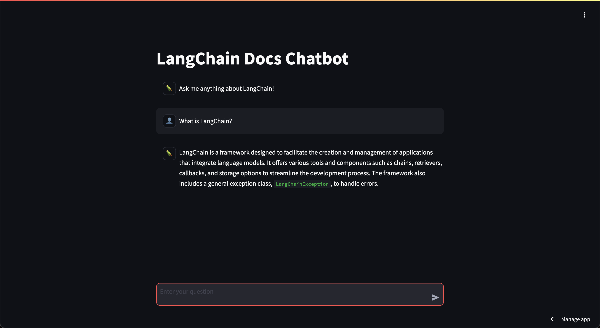

# 🦜🔗 Unofficial LangChain Docs Chatbot

The Unofficial LangChain Docs Chatbot uses retrieval-augmented generation (RAG) and a large-language model (LLM) to answer questions about [LangChain](https://www.langchain.com/).

_An example conversation in the Unofficial LangChain Docs Chatbot._

## Application architecture

- The **backend** is a FastAPI application that uses the [LangServe](https://github.com/langchain-ai/langserve) framework. It runs locally and exposes an `/invoke` endpoint to receive questions and send answers.
- The **frontend** is a Streamlit application. To run it on [Streamlit Community Cloud](https://streamlit.io/cloud), you must first expose the local backend to the internet using [ngrok](https://ngrok.com/). Alternatively, you can run the frontend locally.

## Code

This project consists of four parts:

1. [load_and_split_data.py](./load_and_split_data.py): Extracts text from HTML files containing the LangChain docs, splits the text into chunks, and writes the chunks to a JSONL file.
2. [create_vector_store_with_embeddings.py](./create_vector_store_with_embeddings.py): Retrieves embeddings for each chunk and populates a Chroma vector store with the embeddings, chunks, and chunk metadata (source URL and unique ID).
3. [chatbot_api.py](./chatbot_api.py): Creates a conversational retrieval chain with memory enabled and launches a FastAPI application to make the endpoints available locally.
4. [streamlit_app.py](./streamlit_app.py): Launches the chatbot frontend as a Streamlit application that can be run locally or online using ngrok.

## Technologies used

- [LangChain](https://python.langchain.com/v0.2/docs/introduction/): Chatbot framework
- [Chroma](https://www.trychroma.com/): Vector store
- [tiktoken](https://github.com/openai/tiktoken): Chunk tokenizer
- [OpenAI embeddings](https://platform.openai.com/docs/guides/embeddings): Chunk embeddings generator
- [ChatGPT](https://chatgpt.com/): LLM
- [FastAPI](https://fastapi.tiangolo.com/): API framework
- [LangServe](https://python.langchain.com/v0.2/docs/langserve/): LangChain app deployment framework
- [Streamlit](https://streamlit.io/): Frontend framework
